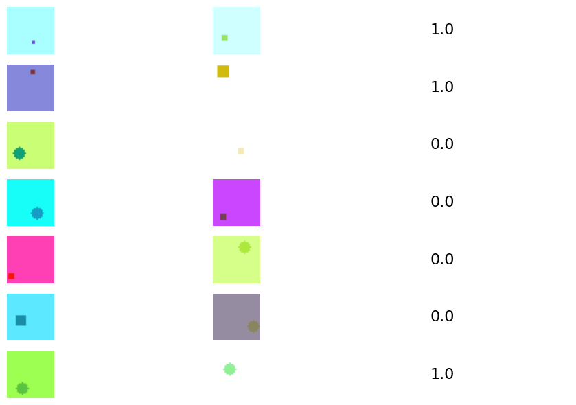
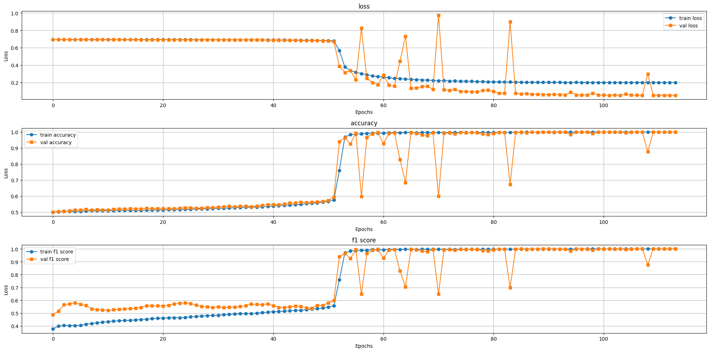
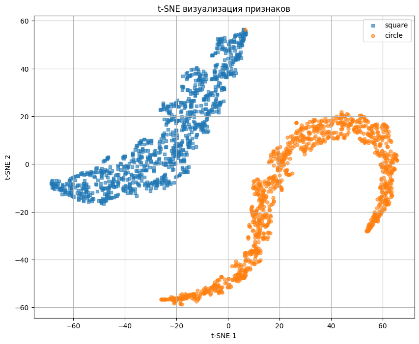

## Содержание
-   [Задача](#Задача)
-   [Зависимости](#Зависимости)
-   [Структура проекта](#Структура-проекта)
-   [Датасет](#Датасет)
-   [Модели](#Модели)
    -   [Общие подходы](#общие-подходы)
    -   [Реализованный подход](#реализованный-подход)
    -   [Архитектура](#архитектура)
    -   [Процесс обучения](#процесс-обучения)
    -   [Выводы](#выводы)
    -   [Веса](#веса)


## Задача

Обучить классификатор, который принимает на вход две картинки одновременно и предсказывает, одинаковые ли на них фигуры.

## Зависимости

Локально

Версия python=3.10
```sh
sh setup.sh
pip install -r requirements.txt
```


## Структура проекта

```
|-- figures     <-  Графики
|-- mlruns      <-  Артефакты экспериментов mlflow
|-- notebooks   <-  Ноутбуки с экспериментами
|-- runs        <-  Результаты запусков (тут хранятся веса при обучении)
|-- src         <-  Исходный код моделей/основных функций
|-- weights     <-  Заранее подготовленные веса
```

## Датасет

Датасет - сгенерированные пары изображений со случайными фигурами (круг, квадрат), в случайном месте и со случайной раскраской. 0 - на картинке не одна и та же фигура, 1 - фигуры одинаковые.



## Модели

### Общие подходы
Для того, чтобы объединить информацию об изображениях в одной архитектуре можно использовать несколько подходов:

1.  На основе сиамской модели: получить фичи от каждого изображения сверточной сетью -> объединение представлений с использованием attention gate -> проекция представлений в общее пространство меньшей размерности -> косинусное сходство между векторами -> полносвязный слой для классификации принадлежности к одному/разным классам
2.  Разделение каждого изображения на патчи -> объединение патчей с разных изображений -> использование Cross-Attention для извлечения представлений -> усреднений представлений по каналам -> поиск разности между усредненными представлениями -> полносвязный слой для классификации результатов разности векторов.
3. Конкатенация изображений по каналам -> CNN -> Классификатор.
4. CNN для каждого изображения (пространственные фичи)-> разбивка фичей на регионы -> косинусное сходство для всех пар регионов и поиск оптимального соответсвия через Венгерский алгоритм (как в задаче трекинга) -> поэлементное умножение признаков для получения общего вектора ->  Классификатор.

### Реализованный подход
Так как изображение небольшие, а паттерны простые, то использование трансформеров и глубоких сетей не принесет хороших результатов. В качестве архитектуры был выбран первый подход за счет его основных преимуществ:

1.  Веса после первого метода можно переиспользовать для инициализации бэкбона для других задач, что позволит ускорить сходимость в других задачах.
2.  Кросс-доменная адаптация в специфических доменах (где ImageNet не подходит).
3.  Интерпретируемость (визуализация областей внимания).

### Архитектура:

```
[Input Image 1]         [Input Image 2]
        |                       |
        ▼                       ▼
[ResNet50 Feature Extractor] (до 5-го слоя)
        |                       |
        ▼                       ▼
[Features 1 (256 channels)]  [Features 2 (256 channels)]
        |                       |
        ▼                       ▼
[Attention Gate] ↔ [Взаимный обмен признаками]
        |                       |
        ▼                       ▼
[Global Average Pooling]    [Global Average Pooling]
        |                       |
        ▼                       ▼
[Projection (256 → 128)]    [Projection (256 → 128)]
        \                       /
         ▼                     ▼
          [Cosine Similarity]
                 |
                 ▼
          [Classifier]
                 |
                 ▼
              [Output]

```

Код см. `src/modeling/models.py` - `AGFusionModel`


### Процесс обучения
Код: `notebooks/train.ipynb`

Функция потерь: `BCEWithLogitsLoss`
Обеспечение стабильности: weight_decay, gradient clipping  



### Выводы

Модель успешно обучилась без явного переобучения. Результат: 0.99 f1_score. При этом при проекции векторов на 2д плоскость они визуально разделимы. 



Улучшения:
1. Использование контрастивного обучения для отдельного обучения feature_extractor и улучшения представлений за счет увеличения расстояний между непохожими объектами (Contrastive Loss|Triplet Loss)
2. Использование подходов [SSL](https://github.com/vturrisi/solo-learn) при обучении feature_exrtactor (Jigsaw, автоэнкодеры для предсказания патча и т.д.).
3. Отдельное обучение feature_extractor и модели проекции с замороженными весами feature_extractor (позволит использовать веса в других задачах).


### Веса
| Модель          | Ссылка                     |
|------------------|-------------------------------------|
| AGFusionModel    | [Скачать](https://drive.google.com/file/d/1-RIl45od71fM0rWieW8YhOAfrqWeAE9q/view?usp=drive_link) |
